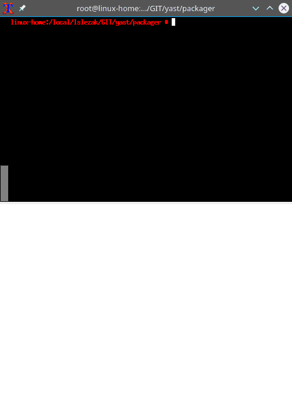
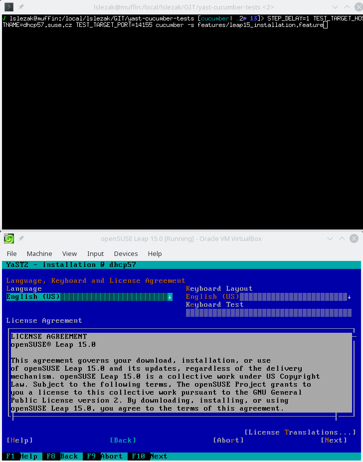
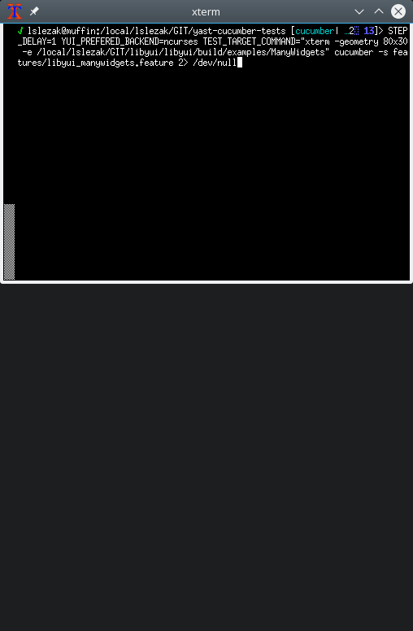

# Experimental Cucumber Tests for YaST

Here are some experimental Cucumber tests for YaST or plain libyui applications.

## :warning: Security :warning:

*The libyui REST API currently does not implement any authentication, anybody
who can access the API port has full control of the running application. This is
especially critical for YaST which usually runs with the administrator (root)
permissions!*

## Installing libyui

These tests require experimental REST API support in the libyui library
which is available in the `http_server` branches in [libyui Git repositories](
https://github.com/libyui) or you can install the experimental RPM
packages for the openSUSE Leap 15.0 distribution.

Run as `root` user:

```sh
zypper ar -f https://download.opensuse.org/repositories/home:/lslezak:/libyui-rest-api/openSUSE_Leap_15.0/ libyui
rpm --import https://build.opensuse.org/projects/home:lslezak:libyui-rest-api/public_key
zypper dup --from libyui --allow-vendor-change
```

:warning: *Use at your risk! The packages are experimental and should not be used
in production systems!* :fire:

Then you can do a quick test to see if the REST API works, run any YaST module:

```
YUI_HTTP_PORT=14155 yast2 repositories
```

While the YaST is running you can dump the current dialog content in JSON
format using this command on the same machine:

```sh
curl -i http://localhost:14155/dialog
```

## Installing Cucumber Ruby Gem

Checkout this Git repository and install the needed Ruby gems using `bundler`
locally:

```sh
git clone https://github.com/lslezak/cucumber-yast.git
cd cucumber-yast
bundle install --path ./.vendor/bundler
```

## Running the Tests

### Testing Locally

- Run the test (as root):
  ```sh
  bundle exec cucumber features/repository_add_new_repo.feature
  ```

  [](
  https://raw.githubusercontent.com/lslezak/cucumber-yast/master/images/cucumber_add_repo_textmode.gif)

### Testing a Remote Instance

Because the libyui REST API uses an HTTP server which can be accessed remotely
then it is easy to run the tests on a different machine. That means you can
even test an YaST installation running in a virtual machine.

To allow remote access to the API you need to additionally set the variable
`YUI_HTTP_REMOTE=1`, otherwise the API will be available only locally.
You might also need to open the used port in firewall.

:warning: *For security reasons enable remote access only in a trusted network
or in a testing machine, using a virtual machine is highly recommended.*


### Testing the YaST Installer

To include the REST API support in the openSUSE Leap 15.0 installer boot the
installer with these extra parameters:

```sh
YUI_HTTP_PORT=14155 YUI_HTTP_REMOTE=1 selfupdate=https://download.opensuse.org/repositories/home:/lslezak:/libyui-rest-api/openSUSE_Leap_15.0/
```

This will update the YaST installer with the packages from the specified
repositories. You will need to import an unknown GPG key during the process.

Then YaST restarts and the REST API should be available from outside.

#### Steps

- Start a patched openSUSE Leap 15.0 installer as described above
- Run the test:
  ```sh
  bundle exec cucumber features/leap15_installation.feature
  ```




### Testing a Plain libyui Application

Cucumber tests can be written also for any application which uses the libyui
framework.

The [features/libyui_manywidgets.feature](features/libyui_manywidgets.feature)
contains a test for the [ManyWidgets.cc](
https://github.com/libyui/libyui/blob/master/examples/ManyWidgets.cc) example.

How to start it (change the path to the example):

```sh
STEP_DELAY=1 YUI_PREFERED_BACKEND=ncurses TEST_TARGET_COMMAND=\
"xterm -geometry 80x30 -e libyui/libyui/build/examples/ManyWidgets" \
cucumber -s features/libyui_manywidgets.feature 2> /dev/null
```

[](
https://raw.githubusercontent.com/lslezak/cucumber-yast/master/images/cucumber_manywidgets_example_textmode.gif)
