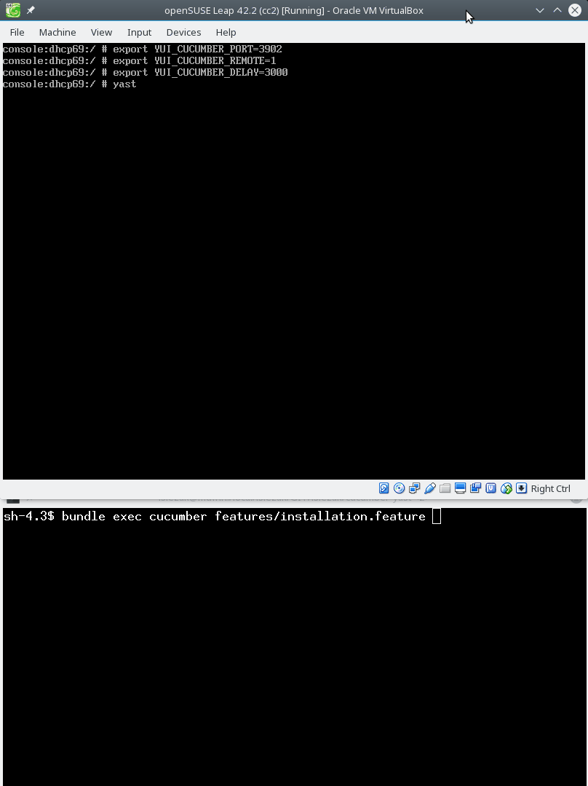

# Experimental Cucumber Tests for YaST

Here are some experimental Cucumber tests for YaST.

## Installation

```sh
bundle install --path ./.vendor/bundler
```

## Running

### Testing YaST Running on the Local Machine

- Run the YaST module (as `root`):
  ```sh
  YUI_CUCUMBER_DELAY=3000 YUI_CUCUMBER_PORT=3902 yast2 repositories
  ```
  The delay defines a sleep after simulating user input, this makes the progress
  of the changes better visible in the UI.

- Run the test:
  ```sh
  bundle exec cucumber features/adding_new_repo.feature
  ```

  [](
    https://raw.githubusercontent.com/lslezak/cucumber-yast/master/images/add_repo.gif)

### Testing a Remote Instance

Because the Cucumber protocol uses a TCP port it is possible to run the tests
on a diffent machine. That means you can even run the tests during installation
in a virtual machine.

- Start a patched installer
- Set these environment variables
  - YUI_CUCUMBER_DELAY=3000
  - YUI_CUCUMBER_PORT=3902
  - YUI_CUCUMBER_REMOTE=1
- Edit the host name stored in the `features/step_definitions/cucumber.wire` file
- Run the test:
  ```sh
  bundle exec cucumber features/installation.feature
  ```
  [](
    https://raw.githubusercontent.com/lslezak/cucumber-yast/master/images/install_leap_42.2.gif)