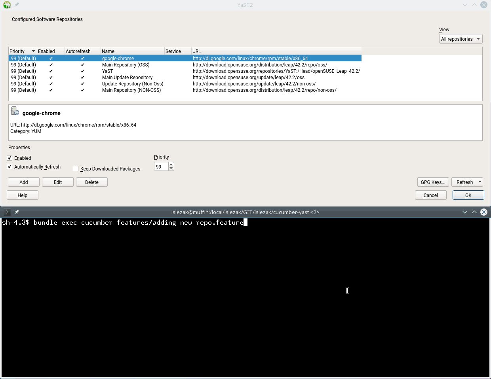

# Experimental Cucumber Tests for YaST

Here are some experimental Cucumber tests for YaST.

## Installation

```sh
bundle install --path ./.vendor/bundler
```

## Running

- Run the YaST module (as `root`):
  ```sh
  YUI_CUCUMBER_DELAY=3000 YUI_CUCUMBER_PORT=3902 yast2 repositories
  ```
  The delay defines a sleep after simulating user input, this makes the progress
  of the changes better visible in the UI.

- Run the test:
  ```sh
  bundle exec cucumber features/adding_new_repo.feature
  ```

  
